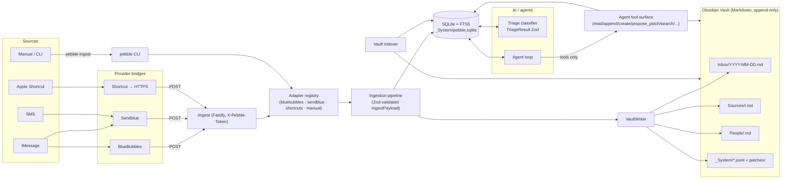

# Pebble Architecture

## Product vision: the agent is a Librarian

Pebble's long-running agent is meant to act as a **semi-automatic Librarian**
of the user's Obsidian Vault. Its job is to receive inbound material
(messages, captures, `/do` commands), file each item into the right note in
the right place, keep links and structure clean, and surface the result.

The default mode is **autonomous within bounds** — the agent triages and
files everything it can confidently route on its own. When it cannot file
confidently (ambiguous target, conflicting candidates, unsafe overwrite,
budget exhausted, missing field, etc.), it must **ask the user back through
iMessage** rather than silently dropping the item or writing to a wrong
location. The user replies in the same thread; the agent treats that reply
as authoritative input and resumes filing.

Implications baked into the architecture:

- The vault is append-only (`writeIngestion` / `appendFile` /
  `proposePatch`), so a wrong guess is always reversible.
- Every action is recorded in `_System/agent-actions.jsonl` and the
  `agent_actions` table, so a clarification thread can quote what was
  attempted and why.
- The send path (`/api/v1/messages/send` on Pebble Bridge, or the matching
  send adapter) is the canonical "ask the user" channel — the same iMessage
  thread that produced the item gets the question back.
- `propose_patch` exists specifically so the Librarian can stage a reversible
  change and ask for approval rather than committing blind.

See `ROADMAP.md` for the concrete capabilities still required to make this
loop end-to-end (Librarian clarification protocol, send-back wiring, reply
routing).

## High-level flow

## Module boundaries

| Module                         | Responsibility                                                          |
| ------------------------------ | ----------------------------------------------------------------------- |
| `src/types`                    | Zod schemas + TS types (the single source of truth)                     |
| `src/config.ts`                | Env → `PebbleConfig` (validated)                                         |
| `src/adapters/*`               | Provider-specific normalizers behind a single `IngestionAdapter`        |
| `src/server/server.ts`         | Fastify HTTP surface: `/health`, `/ingest`, `/recent`, `/search`         |
| `src/ingest/pipeline.ts`       | Vault-write + DB-mirror, deduplication by hash                          |
| `src/vault/writer.ts`          | Append-only writes, daily/thread/person notes, reversible patches       |
| `src/vault/frontmatter.ts`     | YAML frontmatter render/parse (gray-matter)                             |
| `src/vault/paths.ts`           | Vault directory layout + path normalization                              |
| `src/db/{schema.ts,client.ts}` | SQLite schema (FTS5) and typed client                                   |
| `src/indexer/index.ts`         | Walks the vault, populates `notes` + `notes_fts`                         |
| `src/triage/classifier.ts`     | `TriageProvider` interface + `mock` implementation                       |
| `src/triage/runner.ts`         | Batch triage of recent raw ingestions                                    |
| `src/agent/tools.ts`           | Sandboxed tool surface for agents (logs every call)                      |
| `src/cli/index.ts`             | `pebble {init,ingest,triage,index,search,agent,doctor}`                  |

## Append-only & reversibility guarantees

1. The writer creates Markdown files only on first contact; subsequent writes
   are **`fs.appendFile`**.
2. Any non-append edit MUST go through `proposePatch`, which writes:
   - `_System/patches/<id>.before.md` — exact prior bytes (the rollback target).
   - `_System/patches/<id>.diff`     — header + new content + reason.
3. Agents have no general filesystem access; they go through `AgentTools`,
   whose `propose_patch` is the only mutation path that touches existing bodies.
4. Every ingestion is mirrored to `_System/ingestion-log.jsonl` for audit.
5. Every agent tool call is mirrored to `_System/agent-actions.jsonl` *and* to
   the `agent_actions` SQLite table for fast queries.

## Authoritative data

The **vault is authoritative**. SQLite is a regenerable cache (rebuild with
`pebble index`). This keeps Pebble friendly to manual editing in Obsidian.

## Extension points

- **New provider**: drop a file in `src/adapters/` implementing `IngestionAdapter`,
  register it in `src/adapters/index.ts`. The adapter chain runs in order;
  `manual` is the catch-all and must remain last.
- **New AI provider**: implement `TriageProvider` in `src/triage/classifier.ts`,
  return data that parses against `TriageResultSchema`.
- **Subscription-based agent operation** (Claude Code, Codex, etc.): the
  `claude-code` / `codex` provider slots are reserved. Plug a sub-process
  driver into `getProvider()` and let the agent loop call the agent-tools
  surface — they are deliberately RPC-shaped to make CLI-driven agents
  trivial to wire in.
- **Embeddings**: the `notes` table is ready for a sibling `note_embeddings`
  table; the indexer hashes bodies so re-embedding is cheap. Keep the
  embeddings provider behind an interface so local + API options are pluggable.
